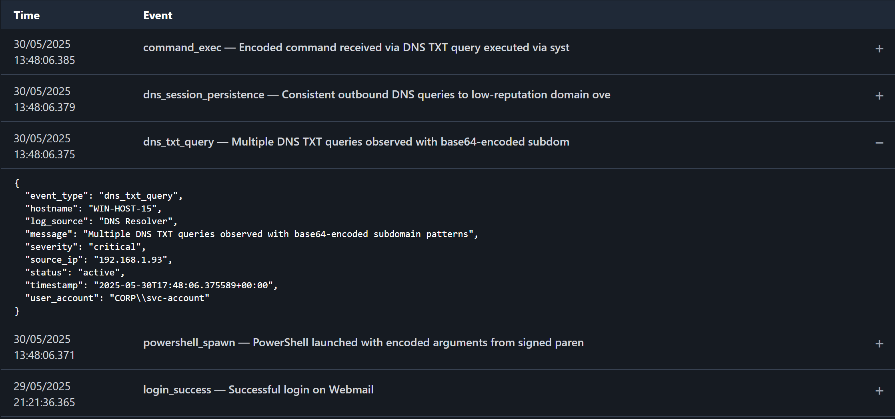
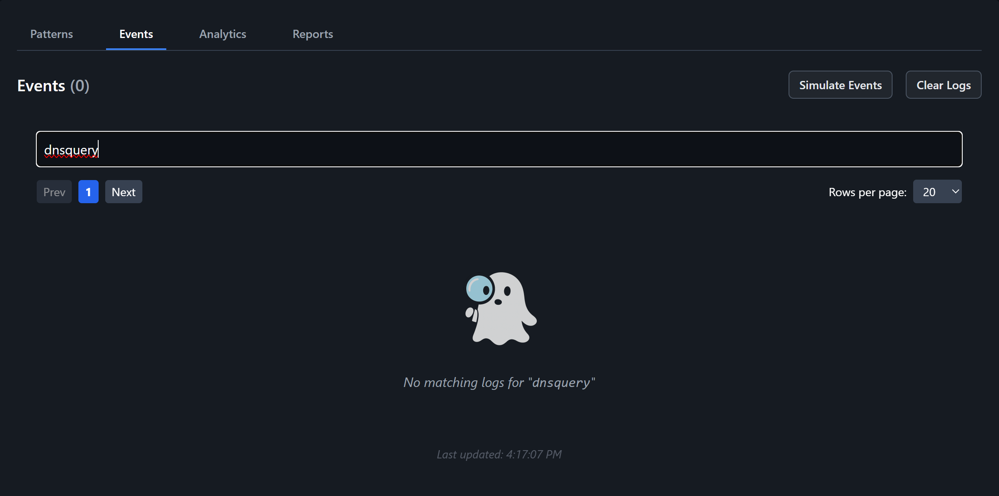

# G.H.O.S.T. - A Full-Stack SOC Simulator for Cybersecurity Training

## Table of Contents

### 1. [Introduction](#introduction)
### 2. [Features](#features)
### 3. [Installation & Setup](#installation--setup)
### 4. [Use Cases](#use-cases)

---

# 1. Introduction

**G.H.O.S.T.** (Guided Help for Operations & Security Triage) is a full-stack **Security Information and Event Management** (SIEM) simulation that replicates a real-world **Security Operations Center** (SOC) environment.

It includes live alert generation, incident reporting, threat analytics, and grouped threat triage. The platform is designed for cybersecurity analyst training, blue team workflows, and hands-on portfolio development in a home lab environment.

---

# 2. Features 

**G.H.O.S.T.** includes a full suite of features designed to simulate a real-world SIEM environment. 

It supports simulated live alert generation, grouped threat patterns, analyst triage actions, incident reporting, threat analytics, and performance scoring

---

## **I. Simulated Live Alert Generation**

Clicking Simulate Events generates a stream of security event logs from various log sources (e.g., firewall, application, operating system), simulating normal background traffic commonly observed in a real SIEM environment.

After several benign logs are generated, a simulated attack scenario is injected to emulate a coordinated threat actor action.

These patterns are structured to resemble real-world hacker tactics, allowing analysts to practice identifying various threat types, including:

- **Brute Force Attacks**

- **Command & Control (C2)** 

- **Persistence Mechanisms**

- **Malware Execution**

- **Data Exfiltration**

- **Insider Threats**

False positives are randomly injected within the log stream to evaluate the analyst’s ability to accurately distinguish between true threats and harmless activity.

---

## **II. Grouped Threat Patterns & Analyst Triage Actions**
**G.H.O.S.T.** automatically groups related logs into threat scenarios using a shared `scenario_id`, enabling more detailed investigations into grouped threat patterns over isolated alerts.

- Groups are formed based on predefined attack sequences, such as multi-step exploits: (e.g., initial access → command execution → data exfiltration).

- Each group is labeled with a **Notable Event** type and a **severity level** 

- Analysts can take decisive actions — **Investigate, Escalate, or Dismiss:**
  
  - **Investigate:** Opens the incident report workflow 

  - **Escalate:** Flags the scenario as a confirmed threat

  - **Dismiss:** Marks the scenario as a false positive

Grouped alerts appear in the **Patterns Tab**, which includes a toggle to switch between:
  
   - **Active Threats:** - Unresolved scenarios that require analyst attention
       
   - **Past Incidents:** - Resolved or reviewed scenarios for post-analysis

---

## **III. Incident Reporting & Threat Categorization**
Allows analysts to submit detailed incident reports capturing investigation results, threat classification, and remediation steps.

Includes an **Incident Report Form** with the following fields:
  
   - Title
       
   - Description
       
   - Severity
       
   - Category
       
   - Affected Hosts
       
   - Mitigation Steps
       
   - Status

  

Reports are stored and displayed in the **Reports Tab**, where analysts can:
   
   - View and manage reports
        
   - Edit report details
        
   - Export reports for documentation and tracking

---

## **IV. Threat Analytics & Performance Scoring**

Includes a real-time analytics dashboard displaying total alerts, critical alert counts, high severity rates, and analyst performance metrics

  
The **Analyst Report Card** displays:
     
  - Dismissed False Positives
    
  - Escalated True Threats

  - Correct Investigations
    
  - Misclassified Alerts
    
  - Total Actions
          
Analyst performance is graded using an A–F scale:

| Grade | Accuracy |
|-------|----------|
| A     | ≥ 90%    |
| B     | 80–89%   |
| C     | 70–79%   |
| D     | 60–69%   |
| F     | < 60%    |

Grades are calculated by comparing correct actions (escalate/investigate/dismiss) against misclassifications.

---

## **V. Interactive Analyst Experience with Real-Time Feedback**
Delivers a responsive, dark-mode UI that mimics the look and feel of modern SIEM platforms like Splunk.

- **Ghost-themed mascot** that guides the analyst and provides contextual feedback based on analyst performance
  
- **Interactive notifications and scenario indicators** offer real-time visual feedback
  
- **High-contrast SOC interface** designed for clarity, accessibility, and realistic analyst workflows

 

 ---

# 3. Installation & Setup

Follow these steps to run **G.H.O.S.T.** locally on your machine:

### 1. Clone the repository
  
      git clone https://github.com/your-username/ghost-siem-simulator.git
      cd ghost-siem-simulator

### 2. Setup the backend

      cd backend
      pip install -r requirements.txt
      python app.py

### 3. Setup the frontend 

      cd frontend
      npm install
      npm start
      
      
### 4. Launch the simulator

Open your browser and navigate to: (http://localhost:3000)
      
 ---     

 # 4. Use Cases

**G.H.O.S.T.** is built for cybersecurity students, entry-level analysts, and anyone looking to gain hands-on experience with real-world SOC workflows. 

Whether you're preparing for a blue team role or building a cybersecurity portfolio, this simulation helps you practice threat detection, incident triage, and reporting in a controlled, interactive environment.

The project was built as a practical platform for learning and demonstrating cybersecurity skills, with key goals to:
 
- Practice analyst workflows in a simulated SOC environment
  
- Demonstrate threat detection and incident response skills
  
- Train new blue team members or students in realistic triage scenarios
  
- Showcase full-stack security engineering capabilities in a portfolio project
