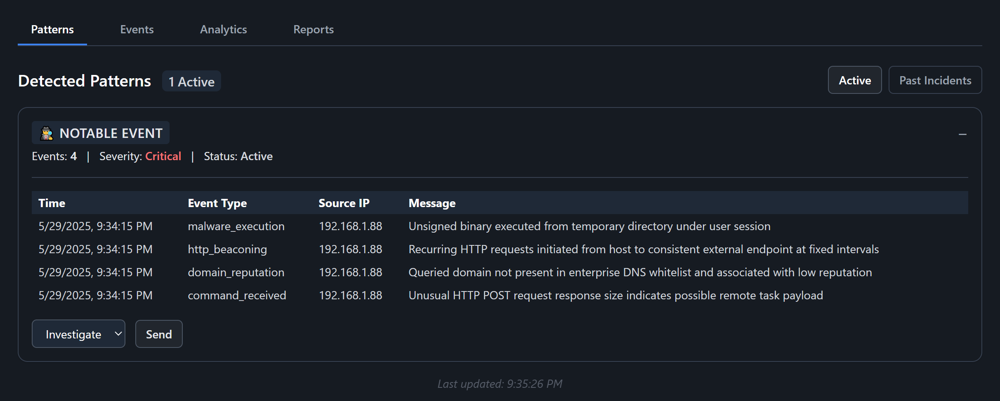

# G.H.O.S.T. - A Full-Stack SOC Simulator for Cybersecurity Training

## Table of Contents

1. Introduction
2. Features
3. Installation & Setup
4. Use Cases
   
# Introduction

**G.H.O.S.T.** (Guided Help for Operations & Security Triage) is a full-stack **Security Information and Event Management** (SIEM) simulation that replicates a real-world **Security Operations Center** (SOC) environment.

It includes real-time log ingestion, alert detection, incident reporting, and threat analytics. Designed for cybersecurity analyst training, scenario-based threat response, and demonstrating a T1 SOC analyst workflow in a home-lab setting.

# Features 

**G.H.O.S.T.** includes a full suite of features designed to simulate a real-world SIEM environment. 

It supports simulated live alert generation, grouped threat patterns, analyst triage actions, and incident reporting. 

Analysts can track their performance over time through a built-in analytics dashboard

## **Simulated Live Alert Generation**


Clicking Simulate Events generates a stream of security event logs from various log sources (e.g., firewall, application, operating system), simulating normal background traffic commonly observed in a real SIEM environment.

After several normal benign logs are generated, the simulator injects a threat scenario, mimicking a coordinated attack by a malicious actor.


These attack patterns are structured to resemble tactics that hackers use in real-world scenarios, allowing analysts to practice detecting many different threat types. Simulated patterns include:

- **Brute Force Attacks**

- **Command & Control (C2)** 

- **Persistence Mechanisms**

- **Malware Execution**

- **Data Exfiltration**

- **Insider Threats**

False positives are randomly injected within the log stream to evaluate the analyst’s ability to accurately distinguish between true threats and harmless activity.

## **Grouped Threat Patterns & Analyst Triage Actions**
**G.H.O.S.T.** automatically groups related log entries into threat patterns using a shared scenario ID, which allows analysts to investigate patterns of malicious activity rather than isolated events.



- Groups are formed based on predefined attack sequences, such as multi-step exploits (e.g., initial access → command execution → data exfiltration).

- Each group is labeled with a threat category and severity level to assist with triage and prioritization.

- Analysts can take decisive actions — Investigate, Escalate, or Dismiss
  
  - **Investigate:** Initiates an in-depth investigation and opens the incident report workflow

  - **Escalate:** Flags the scenario as a confirmed threat

  - **Dismiss:** Marks the scenario as a false positive

- Grouped alerts are displayed in the Patterns Tab, which has two different toggable views:
  
     - **Active Threats:** Unresolved scenarios that require analyst attention
       
     - **Past Incidents:** Previously investigated, escalated, or dismissed scenarios, preserved for audit and review


## **Incident Reporting & Threat Categorization**
Enables analysts to submit professional-grade incident reports that capture key investigation details for audit, triage, and post-incident review.

Includes an Incident Report Form with the following fields
  
   - Title
       
   - Description
       
   - Severity
       
   - Category
       
   - Affected Hosts
       
   - Mitigation Steps
       
   - Status
 


Each report is timestamped and stored for review, and displayed in the Reports Tab, where analysts can:
   
   - View and manage reports
        
   - Edit report details
        
   - Export reports for documentation and incident tracking

 

## **Threat Analytics & Analyst Performance Scoring**
Includes a comprehensive analytics panel that provides real-time visibility into SIEM alert activity, displaying total alerts, critical alert counts, high severity rates, and analyst performance metrics
  
A detailed Analyst Report Card showing key metrics:
     
  - Dismissed False Positives
    
  - Escalated True Threats
    
  - Misclassified Alerts
    
  - Total Actions
          
Features a real-time Performance Grade system (A–F) that evaluates analyst accuracy by calculating the ratio of correct actions — including dismissed false positives, escalated true threats, and                correct investigations — against misclassified alerts, and assigns a grade based on overall performance.

   **Grade Scale:**
   - A: >= 90%
        
   - B: 80-89%
        
   - C: 70-79%
        
   - D: 60-69%
        
   - F: < 60%


## **Immersive Analyst Interface & Themed UX**
Delivers a responsive, dark-mode UI enhanced by ghost mascots, toast alerts, animations, and interactive elements to reflect triage status and user input in real time.

- Ghost-themed mascot that provide motivational and contextual feedback based on analyst performance
  
- Toast alerts and real-time visual indicators tied to analyst actions and scenario status

- A consistent, high-contrast design that mirrors professional-grade SOC tooling while adding an immersive training experience

 


# Installation & Setup

Follow these steps to run **G.H.O.S.T.** locally on your machine:

1. Clone the repository
   
   ```
   git clone https://github.com/your-username/ghost-siem-simulator.git
   cd ghost-siem-simulator
   
3. Setup the backend
   
   ```
   cd backend
   pip install -r requirements.txt
   python app.py

Flask server will start at: http://localhost:5000

3. Setup the frontend UI

   ```
   cd frontend
   npm install
   npm start

4. Launch the simulator

   ``` Open your browser

   http://localhost:5173

 # Use Cases

**G.H.O.S.T.** is built for cybersecurity students, entry-level analysts, and anyone looking to gain hands-on experience with real-world SOC workflows. Whether you're preparing for a blue team role or building a cybersecurity portfolio, this simulation helps you practice threat detection, incident triage, and reporting in a controlled, interactive environment.
 
- Practice analyst workflows in a simulated SOC environment
  
- Demonstrate threat detection and incident response skills
  
- Train new blue team members or students in realistic triage scenarios
  
- Showcase full-stack security engineering capabilities in a portfolio project


