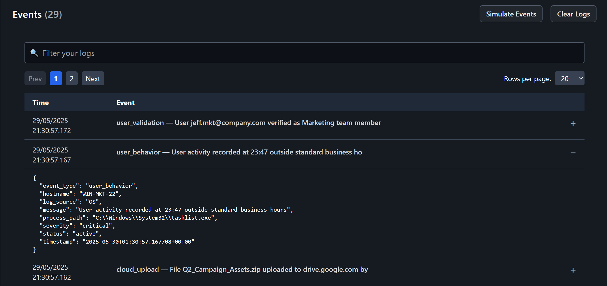

# ghost-siem-simulator
1. Introduction
   
# Introduction

G.H.O.S.T. (Guided Hub for Operations & Security Triage) is a full-stack SIEM (Security Information and Event Management) simulation that replicates a real-world Security Operations Center (SOC) environment. It includes real-time log ingestion, alert detection, incident reporting workflows, and interactive threat analytics. Designed for cybersecurity analyst training, scenario-based threat response, and demonstrating SOC processes in a hands-on setting.

# Features 

**Simulated Real-Time Alert Generation**
- Generates and streams security event logs with dynamic attack scenarios, including false positives, categorized by threat type and severity for realistic SOC training.

Grouped Threat Detection & Pattern Recognition
*Automatically clusters related logs by scenario ID, allowing analysts to triage threats based on contextual attack patterns instead of isolated events.

Interactive Analyst Workflow Actions
*Enables actionable decision-making through built-in analyst responses: Investigate, Escalate, and Dismiss, each triggering state changes and analytics updates.

Structured Incident Reporting with IOC Management
*Includes a professional-grade reporting system where analysts document incident details, assign threat categories, and tag indicators of compromise (IOCs) using chip-style inputs with deduplication.

Integrated Threat Analytics & Analyst Performance Scoring
*Features a Splunk-style dashboard with charts showing threat distributions, alert severity breakdowns, and analyst metrics (accuracy, false positive rate, and resolution time).

Immersive SOC-Themed Interface with Visual Feedback
*Delivers a responsive, dark-mode UI enhanced by ghost mascots, toast alerts, animations, and interactive elements to reflect triage status and user input in real time.

Historical & Active Threat View Toggle
*Provides seamless switching between active scenarios and historical incident reports to reinforce audit trails and post-incident analysis.

---

## Tech Stack

- **Frontend:** React, TailwindCSS, Recharts, Toastify
- **Backend:** Flask (Python), Faker, NDJSON logging
- **Data:** Simulated attack scenarios, false positives, and analyst actions

---

# Interface Overview

## Events Tab  
This is the initial view of the dashboard. When the SOC analyst clicks **Simulate Logs**, the system generates and displays real-time logs in the event table. Selecting **Clear Logs** will remove all current log entries from the view.  

---

### Event Logs View  
Events display real-time logs as they are generated into the event table. Analysts can click on any log entry to expand detailed metadata including timestamp, source, hostname, and event type. This table is critical for identifying suspicious or malicious activity.  

### Analytics and Performance  
The Analytics tab provides a real-time overview of key metrics such as Total Alerts, Critical Alerts, and High Severity Rate. It also includes a performance report card that evaluates the analyst’s actions and assigns a grade based on investigation accuracy and response decisions.  

### Patterns Tab  
The Patterns tab displays grouped alerts based on distinct threat scenarios. Each group aggregates related events that share a common pattern of suspicious activity, such as brute-force attempts, insider threats, or command-and-control behavior. Analysts can take action on each group by investigating, escalating, or resolving it, with all status changes reflected in the dashboard for continuous tracking and visibility.  

### Incident Report Form  
After completing an investigation, the analyst documents the findings by submitting an incident report. This includes selecting a threat category and severity level, describing the observed behavior, identifying the affected hosts, and outlining recommended mitigation steps. The report helps maintain an audit trail for response efforts and supports future threat analysis.  

### Reports Tab  
Shows all submitted incident reports in a structured format. Reports can be edited, exported, and reviewed at any time for audit and tracking purposes.  

### Past Incidents 
The Past Incidents section of the Patterns tab displays all previously addressed scenarios, including those that were dismissed, escalated, or marked as under investigation. This view helps analysts review completed cases, understand prior decisions, and track how each threat was managed throughout the workflow.  

