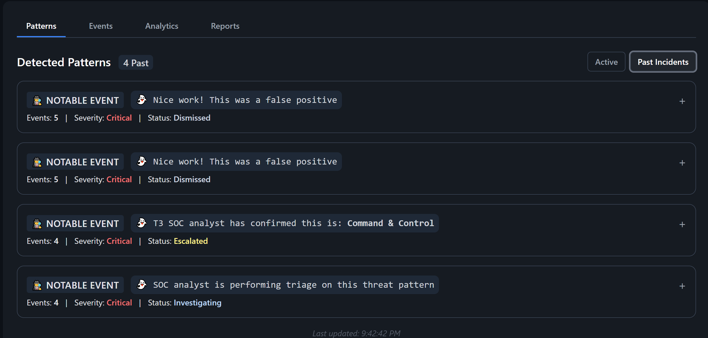

# G.H.O.S.T.
1. Introduction
2. Features
   
# Introduction

**G.H.O.S.T.** (Guided Help for Operations & Security Triage) is a full-stack **Security Information and Event Management** (SIEM) simulation that replicates a real-world **Security Operations Center** (SOC) environment. It includes real-time log ingestion, alert detection, incident reporting workflows, and interactive threat analytics. Designed for cybersecurity analyst training, scenario-based threat response, and demonstrating SOC processes in a hands-on setting.

# Features 

**G.H.O.S.T.** delivers an end-to-end SIEM simulation experience, replicating real-world SOC workflows through live alert generation, grouped threat patterns, analyst decision-making, and structured incident reporting. The platform includes performance analytics, a responsive UI with themed visuals, and seamless toggling between active threats and past incidents — making it ideal for cybersecurity training, demonstrations, and portfolio showcase.

## **Simulated Real-Time Alert Generation**

Generates and streams security event logs with dynamic attack scenarios, including false positives, categorized by threat type and severity for realistic SOC training.

Each log entry includes a timestamp, event type, severity level, and descriptive message modeled after realistic enterprise scenarios. These include:

- Command and & Control (C2) via DNS tunneling

- Persistence mechanisms using outbound DNS queries

- PowerShell execution with obfuscated arguments

- Suspicious HTTP requests to known malicious domains

- Login events simulating both valid and anomalous user behavior

The generated logs mimic the diversity and noise found in actual SIEM environments by mixing malicious activity, normal user behavior, and false positives — challenging analysts to distinguish between them accurately.

Displayed in the Events Tab, the interface supports:

- Live pagination and adjustable rows per page

- Search and filtering for specific logs by keyword

- A Simulate Events button that triggers a new batch of synthetic logs, including both benign and malicious behaviors

- A Clear Logs button that resets the event feed, removing all previously generated logs for a fresh session or scenario restart

This system forms the core of **G.H.O.S.T.’s** interactive alert simulation, offering a hands-on training loop for analysts to detect, classify, and respond to evolving threat patterns.

**Grouped Threat Detection & Pattern Recognition**
- Automatically clusters related logs by scenario ID, allowing analysts to triage threats based on contextual attack patterns instead of isolated events.

**Interactive Analyst Workflow Actions**
- Enables actionable decision-making through built-in analyst responses: Investigate, Escalate, and Dismiss, each triggering state changes and analytics updates.

## **Incident Reporting & Threat Categorization**
Enables analysts to submit professional-grade incident reports that capture key investigation details for audit, triage, and post-incident review.

Includes an Incident Report Form with the following fields
  
   - Title
       
   - Description
       
   - Severity
       
   - Category
       
   - Affected Hosts
       
   - Mitigation Steps
       
   - Status
 

Each report is timestamped and stored for review, and displayed in the Reports Tab, where analysts can:
   
   - View and manage reports
        
   - Edit report details
        
   - Export reports for documentation and incident tracking

 

## **Threat Analytics & Analyst Performance Scoring**
Includes a comprehensive analytics panel that provides real-time visibility into SIEM alert activity, displaying total alerts, critical alert counts, high severity rates, and analyst performance metrics
  
A detailed Analyst Report Card showing key metrics:
     
  - Dismissed False Positives
  - Escalated True Threats
  - Misclassified Alerts
  - Total Actions
          
Features a real-time Performance Grade system (A–F) that evaluates analyst accuracy by calculating the ratio of correct actions — including dismissed false positives, escalated true threats, and                correct investigations — against misclassified alerts, and assigns a grade based on overall performance.

   **Grade Scale:**
        - A: >= 90%
        - B: 80-89%
        - C: 70-79%
        - D: 60-69%
        - F: < 60%

**SOC-Themed Interface with Visual Feedback**
- Delivers a responsive, dark-mode UI enhanced by ghost mascots, toast alerts, animations, and interactive elements to reflect triage status and user input in real time.

**Active & Past Incidents Threat View Toggle**
- Provides seamless switching between active scenarios and historical incident reports to reinforce audit trails and post-incident analysis.

# Interface Overview

### Event Logs View  
Events display real-time logs as they are generated into the event table. Analysts can click on any log entry to expand detailed metadata including timestamp, source, hostname, and event type. This table is critical for identifying suspicious or malicious activity.  

### Patterns Tab  
The Patterns tab displays grouped alerts based on distinct threat scenarios. Each group aggregates related events that share a common pattern of suspicious activity, such as brute-force attempts, insider threats, or command-and-control behavior. Analysts can take action on each group by investigating, escalating, or resolving it, with all status changes reflected in the dashboard for continuous tracking and visibility.  

### Past Incidents 
The Past Incidents section of the Patterns tab displays all previously addressed scenarios, including those that were dismissed, escalated, or marked as under investigation. This view helps analysts review completed cases, understand prior decisions, and track how each threat was managed throughout the workflow.  

